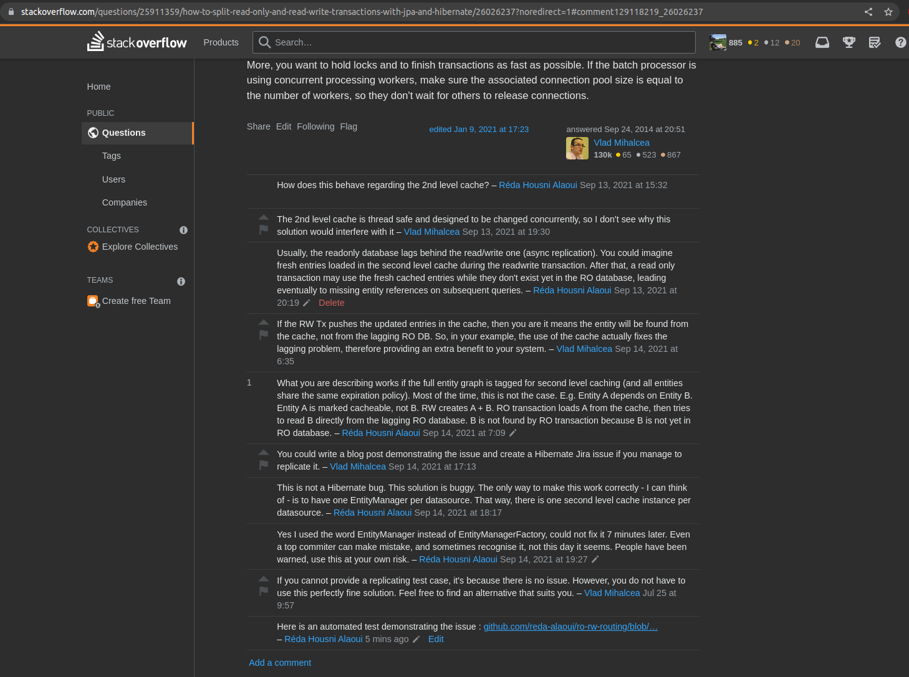
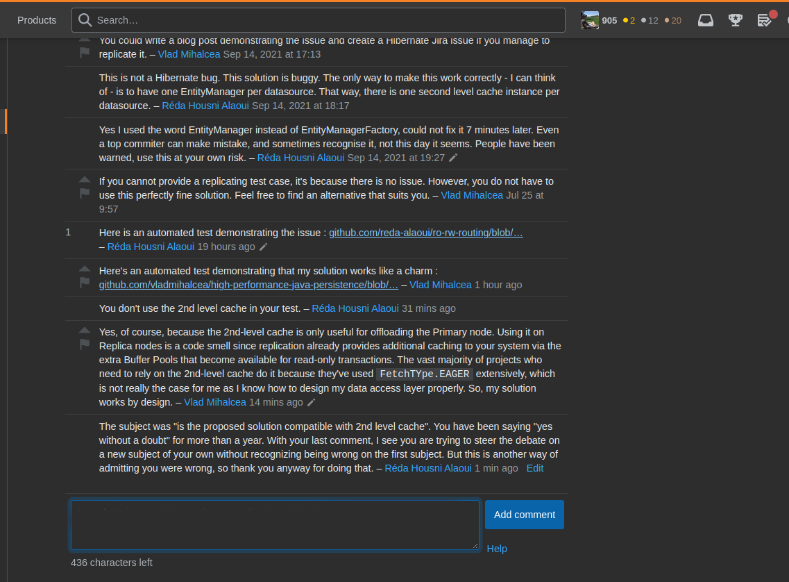
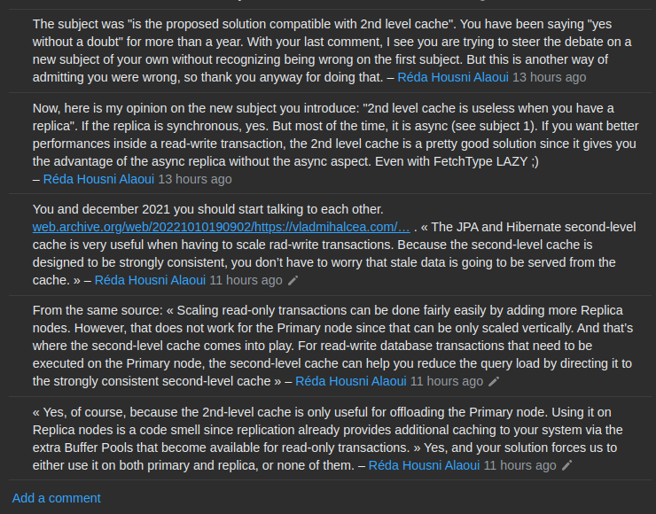

Demonstration of https://web.archive.org/web/20221009210947/https://stackoverflow.com/questions/25911359/how-to-split-read-only-and-read-write-transactions-with-jpa-and-hibernate/26026237?noredirect=1#comment122259600_26026237

[Stack Overflow conversation transcript](so-transcript.md)

Conversation screenshots:

